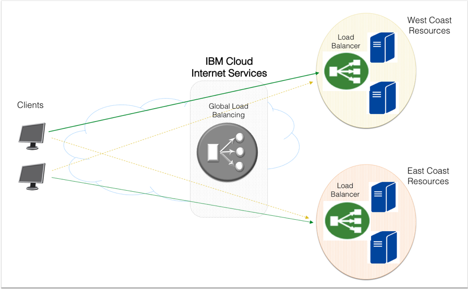

---

copyright:
  years: 2018, 2019
lastupdated: "2019-04-26"

keywords: domain Input information, IBM Cloud Internet Services, Global Load balancing

subcollection: cis

---

{:shortdesc: .shortdesc}
{:codeblock: .codeblock}
{:screen: .screen}
{:new_window: target="_blank"}
{:pre: .pre}
{:table: .aria-labeledby="caption"}
{:DomainName: data-hd-keyref="DomainName"}
{:note: .note}
{:important: .important}
{:deprecated: .deprecated}
{:generic: data-hd-programlang="generic"}

# Improving application reliability and scalability with Global Load Balancing from {{site.data.keyword.cis_full}}
{:#improving-application-reliability-and-scalability-with-global-load-balancing-from-ibm-cloud-internet-services}

If you have an e-commerce website or are hosting an application that needs to be accessible to your end-users at all times, then you're likely concerned about 24*7 availability and performance of your application.

The global load balancing capabilities available with the {{site.data.keyword.cis_full_notm}} ({{site.data.keyword.cis_short_notm}}) can help improve reliability and scalability of your applications while delivering the best possible end-user experience. This guide provides a walkthrough of the global load balancing configuration.
{:shortdesc}

## What you'll accomplish
{:#what-you-accomplish}

In this Step-by-Step you will learn how to configure a setup similar to the one illustrated below.

In this example, the application resources are deployed in two data center locations, one in US West and the other in US East Coast. The end-users may be accessing this application from all over the world.

Task  | Description
------------- | -------------
[Create a {{site.data.keyword.cis_short_notm}} instance](/docs/infrastructure/cis?topic=cis-create-your-cis-instance) | Begin by Creating your {{site.data.keyword.cis_short_notm}} instance using the {{site.data.keyword.cloud_notm}} console.|
[Input information about your domain](/docs/infrastructure/cis?topic=cis-input-information-about-your-domain) | Input information about the domain you wish to protect and provide global load balancing for.
[Begin Global Load Balancer configuration](/docs/infrastructure/cis?topic=cis-begin-global-load-balancer-configuration) | Start configuring your Global Load Balancer.
[Identify your application resources](/docs/infrastructure/cis?topic=cis-identify-your-application-resources) | Identify the your application's resources, such as origin pools and health check mechanisms.
[Define the global load balancer](/docs/infrastructure/cis?topic=cis-define-the-global-load-balancer) | Define your global load balancer configuration by specifying a hostname, adding and adjusting your origin pools and defining additional rules to control how traffic is served to clients.
