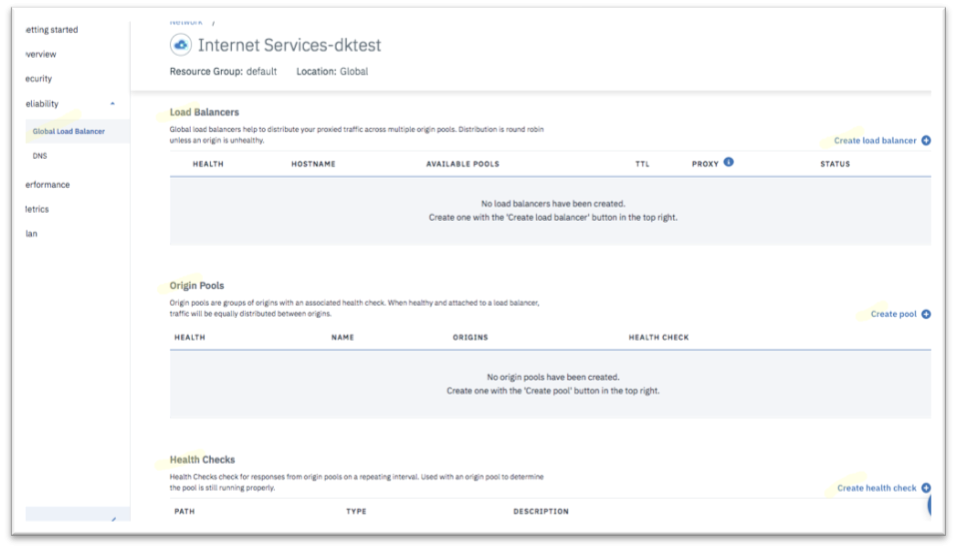
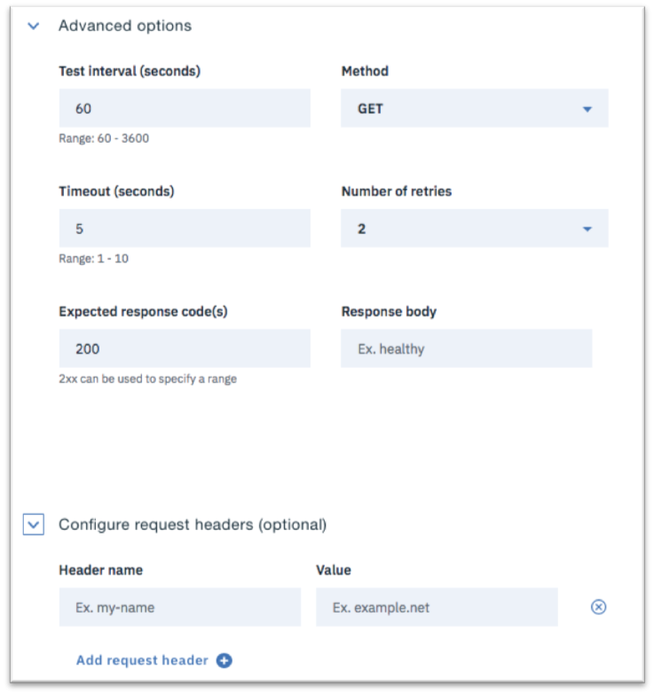

---

copyright:
  years: 2018, 2019
lastupdated: "2019-03-14"

keywords: global load balancer configuration, glb configuration

subcollection: cis

---

{:shortdesc: .shortdesc}
{:codeblock: .codeblock}
{:screen: .screen}
{:new_window: target="_blank"}
{:pre: .pre}
{:table: .aria-labeledby="caption"}
{:note: .note}

# Begin Global Load Balancer configuration
{:#begin-global-load-balancer-configuration}

Start configuring your Global Load Balancer.

1. Under the **Reliability** section, select **Global Load Balancer**.

    

2. Scroll down to the Health Checks section.

   This configuration is optional. If you do not define any custom health checks, the system will use “/” as your default health check path.
   {:note}

3. Click the **Create health check** button to define a custom health check.   

   Provide the path you wish to conduct your health checks on. You may use either HTTP or HTTPS protocols for your health checks.

4. Under **Advanced options**, you can customize other parameters, such as the health check interval, the number of retries, the request method and response body, under Advanced options.

   

5. Click **Provision Resource** to complete your health check configuration.
