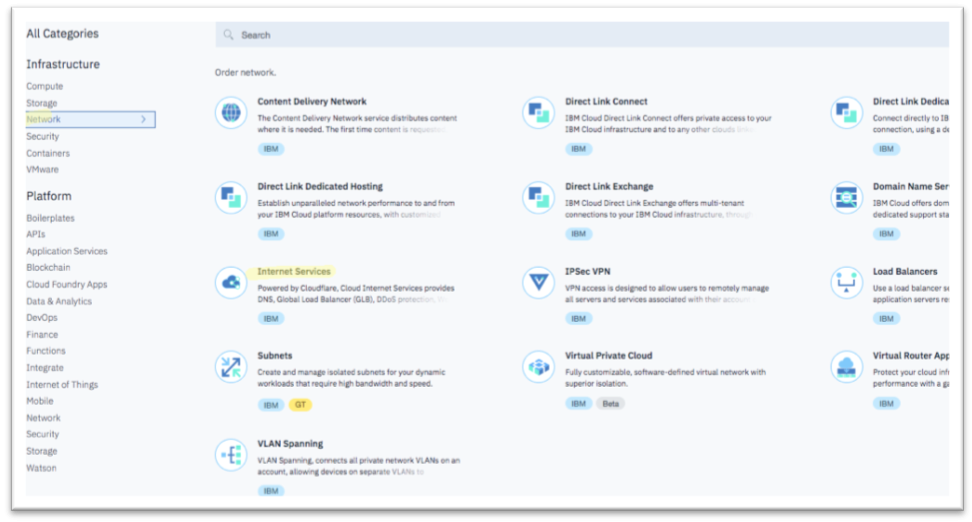
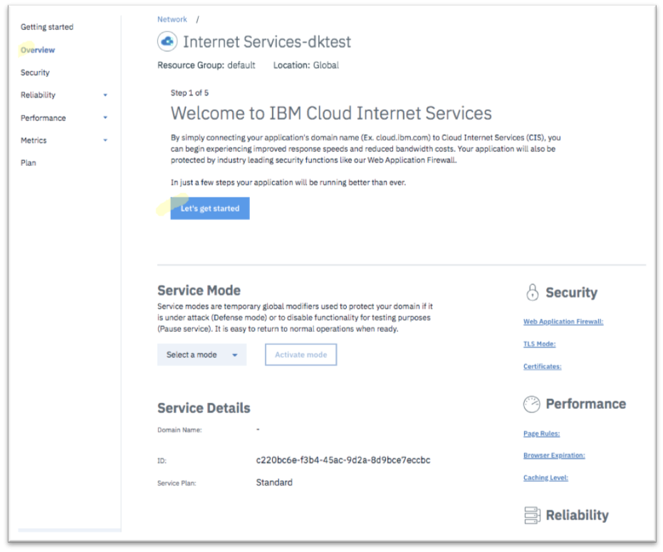

---

copyright:
  years: 2018, 2019
lastupdated: "2019-03-14"

keywords: IBM Cloud Internet Services, setup flow

subcollection: cis

---

{:shortdesc: .shortdesc}
{:codeblock: .codeblock}
{:screen: .screen}
{:new_window: target="_blank"}
{:pre: .pre}
{:table: .aria-labeledby="caption"}
{:DomainName: data-hd-keyref="DomainName"}
{:note: .note}
{:important: .important}
{:deprecated: .deprecated}
{:generic: data-hd-programlang="generic"}

# Create your IBM Cloud Internet Services (CIS) instance
{:#create-your-cis-instance}

To create a CIS instance, perform the following procedure:

1. From your browser, open the [{{site.data.keyword.cloud_notm}} console](https://{DomainName}/){: new_window} and log into your account.
2. Click **Catalog** at the top right, and from the  **Infrastructure** section select **Network**. Then click **Internet Services**.

   

3. Specify the name for your service instance, and identify the resource group you’d like to place this service in. The default resource group is `default`. Review the plan summary and click **Create**.

The system will take you to a setup flow on the Overview page for a quick review of the service.

