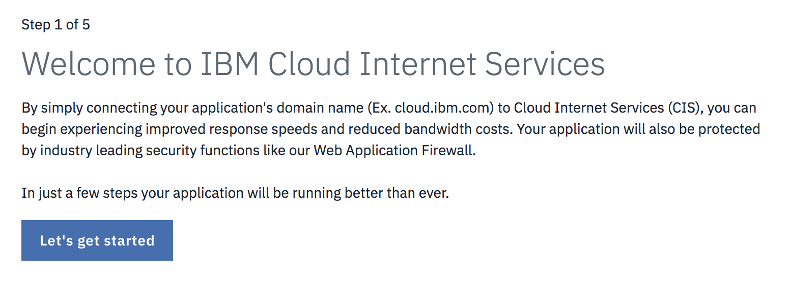
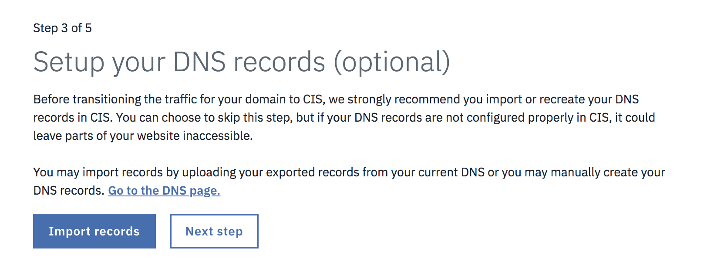

---

copyright:
  years: 2018, 2019
lastupdated: "2019-07-25"

keywords: IBM Cloud Internet Services, IBM CIS application, Authoritative DNS servers, CIS

subcollection: cis

---

{:shortdesc: .shortdesc}
{:new_window: target="_blank"}
{:DomainName: data-hd-keyref="DomainName"}
{:note: .note}
{:important: .important}
{:deprecated: .deprecated}
{:external: target="_blank" .external}
{:generic: data-hd-programlang="generic"}

# Getting started with {{site.data.keyword.cis_full_notm}}
{: #getting-started}

{{site.data.keyword.cis_full}} ({{site.data.keyword.cis_short_notm}}), powered with Cloudflare, offers three main capabilities to enhance your workflow: [security](/docs/infrastructure/cis?topic=cis-manage-your-ibm-cis-for-optimal-security), [reliability](/docs/infrastructure/cis?topic=cis-manage-your-ibm-cis-deployment-for-optimal-reliability), and [performance](/docs/infrastructure/cis?topic=cis-manage-your-cis-deployment-for-best-performance). Each area of capability is represented in the navbar of your screen, once you've opened the {{site.data.keyword.cis_short_notm}} application.

For each capability, {{site.data.keyword.cis_short_notm}} helps you tune its features to suit your specific needs, including:

 * Authoritative DNS servers
 * Global and Local Load Balancing
 * Web Application Firewall (WAF)
 * DDoS Protection
 * Caching and page rules

## Before you begin
{:#before-you-begin}

Before you begin using {{site.data.keyword.cis_short_notm}}, you'll first need an [IBMid](https://www.ibm.com/account/reg/us-en/signup?formid=urx-19776). Then you can order your services through your IBM Cloud Account, or through the new [IBM Cloud Internet Services Portal](https://{DomainName}/catalog/services/internet-services), depending on your preference.

If you need assistance in obtaining an account to use {{site.data.keyword.cis_full_notm}}, [contact your IBM sales representative](https://{DomainName}/cloud/support) for additional guidance on getting started.

If you have an existing Softlayer account, you can [link your account](/docs/account?topic=account-unifyingaccounts) with your IBMid. 

## Process overview
{:#process-overview}

You can start using {{site.data.keyword.cis_short_notm}} for your Internet traffic with just a few steps.

 * Open the {{site.data.keyword.cis_short_notm}} application from your IBM Cloud dashboard.
 * Add the domain you want to manage.
 * Configure your DNS information with the name servers we've provided.
 * Continue getting started with {{site.data.keyword.cis_short_notm}}, by following a tutorial or by setting up other features.

### Step 1: Open the IBM CIS application
{:#open-cis-application}

Open your [IBM Cloud dashboard](https://{DomainName}/catalog/). Then navigate to the {{site.data.keyword.cis_short_notm}} application icon by selecting the **Infrastructure -> Network** category in the navigation bar of the dashboard. Open the {{site.data.keyword.cis_full_notm}} application by clicking the icon in the dashboard. 

**The Overview Screen**

After the {{site.data.keyword.cis_short_notm}} application starts up, you'll see the {{site.data.keyword.cis_short_notm}} **Overview** screen, and you'll find the tabs for **Security**, **Reliability**, and **Performance**.

**Which plan do I choose?**

There are 4 plans to choose from, 
* **Enterprise Usage** 
* **Enterprise Package** 
* **Standard Plan** 
* **Free Trial**. 

The **Free Trial** expires after 30 days, at which point you can upgrade to the **Standard Plan** or an **Enterprise Plan**. A single **Standard** instance can manage one domain. You can create as many **Standard** service instances as you want within a single account, each managing a single domain. 

The **Enterprise Plans** allow you to manage multiple domains in a single service instance. Select the **Create** button on the **Overview** screen to begin provisioning your account.

The **Free Trial** is limited to one instance per account. 
{:note}

**Begin Provisioning**

You'll see the first screen of the {{site.data.keyword.cis_short_notm}} application, where you'll select the **Add Domain** button to begin.

### Step 2. Add and configure your Domain.
{:#add-configure-your-domain}

Select **Let's get started** from the welcome page to begin setting up {{site.data.keyword.cis_short_notm}}.

Next, begin protecting and improving the performance of your web service by entering your domain or a subdomain.

Please specify DNS zones. You can configure the nameservers for these domains or subdomains at the domain's registrar or DNS provider. Do not use CNAMEs.
{:note}

The Overview screen will show your domain in `Pending` status. Your domain will remain `Pending` until you complete configuring your Name Servers with the Registrar or existing DNS provider, covered in Step 4.

The {{site.data.keyword.cis_short_notm}} instance cannot be deleted after a domain has been added. To delete the instance, please delete the domain from the instance first.
{:note}

### Step 3. Set up your DNS records (optional).
{:#setup-your-dns-records}

Before transitioning the traffic for your domain to {{site.data.keyword.cis_short_notm}}, we strongly recommend that you import or re-create your DNS records in {{site.data.keyword.cis_short_notm}}. You can choose to skip this step, but if your DNS records are not configured properly in {{site.data.keyword.cis_short_notm}}, it could leave parts of your website inaccessible.

Import records by uploading your exported records from your current DNS or manually create your DNS records. To import records select **Import records**.

When you are finished, or if you would like to skip this step, select **Next step**.

### Step 4. Configure your Name Servers with the Registrar or existing DNS Provider.
{:#configure-your-name-servers-with-the-registrar-or-existing-dns-provider}

To begin receiving the benefits of {{site.data.keyword.cis_short_notm}}, configure your registrar or domain name provider to use the name servers listed. If you're delegating a domain (something like `example.com`), configure the listed name servers in your domain's settings, where they are managed by your registrar (for example, on the registrar's web portal). If you are unsure of who the registrar is for your domain, you can look it up at [whois.icann.org](https://whois.icann.org/){:external}. If you delegate a subdomain (for instance, `subdomain.example.com`) from another DNS provider, you must replace the existing Name Server (NS) records and replace them with a NS record for each of the name servers provided by {{site.data.keyword.cis_short_notm}}. See [Managing DNS Records](https://support.cloudflare.com/hc/en-us/articles/360019093151-Managing-DNS-records-in-Cloudflare){:external}, written by our partners at Cloudflare, for detailed instructions by provider.

After you've configured your registrar or DNS provider, it may require up to 24 hours for the changes to take effect. When we verify that the specified nameservers have been configured correctly for your domain or subdomain, the domain's status changes from `Pending` to `Active`. After configuring the nameservers, you may click on the "Recheck name servers" link in the `Overview` page to potentially accelerate the activation of your domain (you can submit this check only once an hour).

Your domain must move to `Active` state within 60 days or your domain and any configuration data will be removed. 
{:note}

### Step 5. Ensure that {{site.data.keyword.cis_full_notm}} is resolving the domain information for your application, hostname, or website.
{:#ensure-cis-is-resolving-domain-info}

To proceed, select the **Reliability** tab from your left-hand navbar, then select the **DNS** option. Be sure to add the appropriate _DNS Records_. Add the **A Record** and any **AAAA** or **MX** entries that are populated. If you forget to add these records before the registrar's delegation is complete, {{site.data.keyword.cis_full_notm}} cannot resolve the domain information for your internet-facing applications.

### Step 6. In the meantime, you can begin managing other {{site.data.keyword.cis_short_notm}} functions and features.
{:#manage-other-cis-functions}

For more details about managing other functions and features, please see the [step-by-step instructions](/docs/infrastructure/cis?topic=cis-manage-your-cis-deployment#manage-your-cis-deployment).
