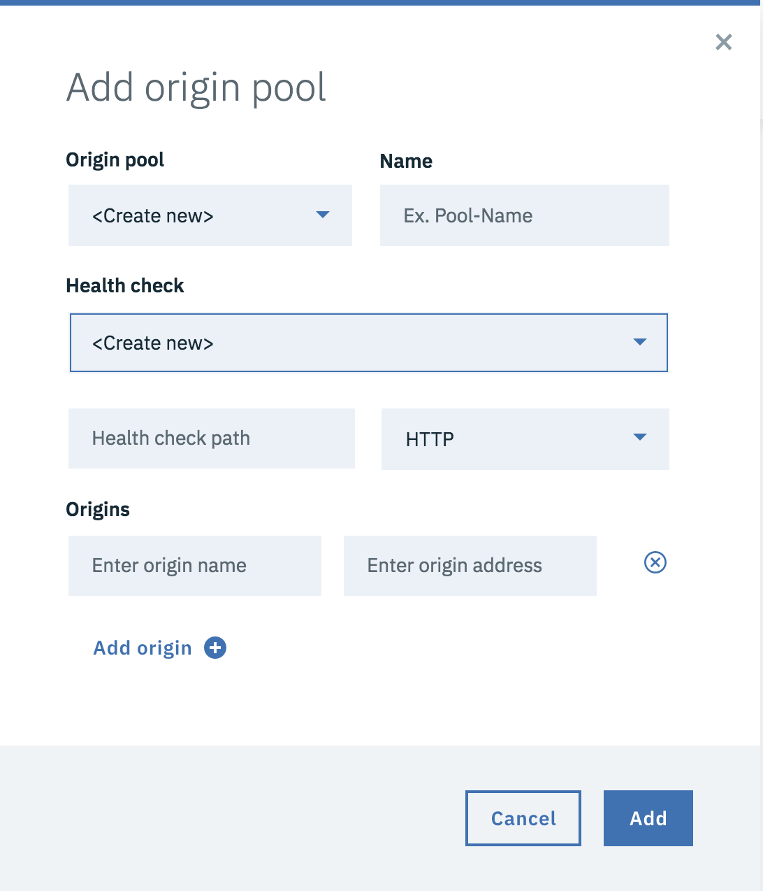

---

copyright:
  years: 2018, 2019
lastupdated: "2019-11-04"

keywords: Create Load Balancer, Global Load Balancer, health checks, quick setup

subcollection: cis

---

{:shortdesc: .shortdesc}
{:new_window: target="_blank"}
{:codeblock: .codeblock}
{:pre: .pre}
{:screen: .screen}
{:term: .term}
{:tip: .tip}
{:note: .note}
{:important: .important}
{:deprecated: .deprecated}
{:external: target="_blank" .external}
{:generic: data-hd-programlang="generic"}
{:download: .download}
{:DomainName: data-hd-keyref="DomainName"}

# Global Load Balancer quick setup
{:#global-load-balancer-quick-setup}

You can directly create pools and health checks from the **Create Load Balancer** menu option. Navigate to **Reliability > Global Load Balancer > Create load balancer > Add pool**, and select the option to **Create New** under Origin pool.
{: shortdesc}

Input a pool name, [origins](#x2210603){:term}, and select a [health check](#x4571658){:term}. You can create a new health check here by choosing **Create New** in the **Health Check** list menu, and entering the information to create the health check.

For fully configurable options, use the longer setup method in [Set up and configure your load balancers](/docs/infrastructure/cis?topic=cis-set-up-and-configure-your-load-balancers).
