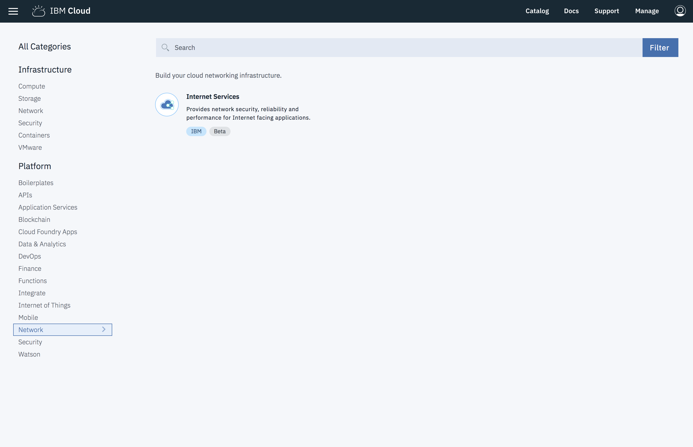

---
copyright:
  years: 2018
lastupdated: "2018-03-19"
---

{:shortdesc: .shortdesc}
{:new_window: target="_blank"}

# IBM Cloud Internet Services (CIS) 入門

IBM Cloud Internet Services (CIS) は、お客様のワークフローを強化するために、[セキュリティー](/docs/infrastructure/cis/managing-for-security.html)、[信頼性](/docs/infrastructure/cis/managing-for-reliability.html)、および[パフォーマンス](/docs/infrastructure/cis/managing-for-performance.html)という 3 つの主要な機能を提供します。
IBM CIS アプリケーションを開くと、画面左側のナビゲーション・バーに各機能の領域が表示されます。

どの機能についても、IBM CIS では、お客様固有のニーズに合わせて個々のフィーチャーをチューニングできます。フィーチャーの例を次に示します。

 * 権威 DNS サーバー
 * グローバルおよびローカルのロード・バランシング
 * Web アプリケーション・ファイアウォール (WAF)
 * DDoS 防御
 * キャッシュ・ルールとページ・ルール

## 始める前に
IBM CIS を使用するには、まず [IBMid](https://www.ibm.com/account/us-en/signup/register.html) が必要です。次に、好みに応じて IBM Cloud アカウントまたは新しい [IBM Cloud Internet Services ポータル](https://console.bluemix.net/catalog/services/internet-services)を使用して、サービスを注文できます。

IBM Cloud Internet Services を使用するためのアカウントの取得方法がわからない場合は、利用を開始するための詳細な手順を、[IBM 営業担当員にお問い合わせください](https://www.ibm.com/cloud-computing/bluemix/contact-us)。

既存の Softlayer アカウントがある場合は、IBMid に[そのアカウントをリンク](https://console.bluemix.net/docs/account/softlayerlink.html#unifyingaccounts)できます。 

## プロセスの概要

ほんのいくつかの手順を実行するだけで、インターネット・トラフィックに IBM CIS を使用できるようになります。

 * IBM Cloud ダッシュボードから IBM CIS アプリケーションを開きます。
 * 管理するドメインを追加します。
 * IBM 提供のネーム・サーバーをお客様の DNS 情報に構成します。
 * チュートリアルに従って、または他の機能をセットアップして、IBM CIS の使用準備を進めます。

### 手順 1: IBM CIS アプリケーションを開きます。

 [IBM Cloud ダッシュボード](https://console.bluemix.net/catalog/)を開きます。次に、ダッシュボードの左側のナビゲーション・バーで**「プラットフォーム」->「ネットワーク」**カテゴリーを選択して、IBM CIS アプリケーション・アイコンに移動します。画面のほぼ中央に表示されるアイコンをクリックして、IBM Cloud Internet Services アプリケーションを開きます。 

**「概要」画面**

IBM CIS アプリケーションが起動すると、IBM CIS の**「概要」**画面が表示されます。UI 表示の左の領域には**「セキュリティー」**、**「信頼性」**、**「パフォーマンス」**タブがあります。

**どのプランを選択すればよいか?**

_Early Access_ リリースの場合、選択できるプランは 1 つだけです。これは無料です。**「概要」**画面の左下の**「作成」**ボタンをクリックして、アカウントのプロビジョニングを開始します。

**プロビジョニングの開始**

IBM CIS アプリケーションの最初の画面が表示されます。ここで**「ドメインの追加 (Add Domain)」**ボタンを選択して開始します。

|**Early Access プログラムは 1 アカウントにつき 1 インスタンスに制限されているので注意してください。** |
|-------------------------------------------------------------------|
| リソース・インスタンスを作成してドメインを追加したら、新たに IBM CIS のリソース・インスタンスを追加することはできません。この制限は、試用ドメインを削除してから再び同じリソース・インスタンスにドメインを追加しようとした場合にも適用されます。この操作を行うと、エラーが表示されます。|

### 手順 2. ドメインを追加して構成します。

Web サービスを保護してパフォーマンスを向上させるために、まず、ドメインまたはサブドメインを入力します。

**注:** DNS ゾーンを指定してください。これらのドメインまたはサブドメインのネームサーバーは、ドメインのレジストラーまたは DNS プロバイダーで構成できます。CNAME は使用しないでください。

「概要」画面に、ドメインの状態が`「保留中」`と表示されます。手順 3 を完了するまで、ドメインは`「保留中」`のままです。

**注:** ドメインが追加されたら、IBM CIS インスタンスは削除できなくなります。インスタンスを削除するには、まずインスタンスからドメインを削除してください。

### 手順 3. レジストラーまたは既存の DNS プロバイダーにネーム・サーバーを構成します。

IBM CIS の利点を活用するには、リストされたネーム・サーバーを使用するように、レジストラーまたはドメイン・ネーム・プロバイダーを構成します。ドメイン (例: `example.com`) を委任する場合は、リストされたネーム・サーバーを、レジストラー管理のドメイン設定 (レジストラーの Web ポータルなど) に構成します。ドメインのレジストラーが不明な場合は、https://whois.icann.org/ で検索できます。サブドメイン (例: `subdomain.example.com`) を別の DNS プロバイダーから委任する場合は、リストされた各ネーム・サーバーのネーム・サーバー (NS) レコードを追加する必要があります。

お客様がレジストラーまたは DNS プロバイダーを構成してから、その変更が反映されるまでに最大で 24 時間かかる可能性があります。指定のネームサーバーがドメインまたはサブドメインに対して正しく構成されたことを IBM が確認すると、ドメインのステータスが`「保留中」`から`「アクティブ」`に変わります。ネームサーバーを構成した後に、`「概要」`ページの「ネーム・サーバーの再チェック (Recheck name servers)」リンクをクリックすると、ドメインのアクティブ化が早まる可能性があります (このチェックは 1 時間に一度だけ実行できます)。

### 手順 4. IBM Cloud Internet Services がアプリケーション、ホスト名、または Web サイトのドメイン情報を解決することを確認します。

始めに、左側のナビゲーション・バーから**「信頼性」**タブを選択し、**「DNS」**オプションを選択します。必ず、適切な _DNS レコード_ を追加してください。自動入力される **A レコード**および任意の **AAAA** または **MX** エントリーを追加します。レジストラーの委任が完了する前にこれらのレコードを追加しておかないと、IBM Cloud Internet Services は、インターネットに公開されているアプリケーションのドメイン情報を解決できません。  

### 手順 5. この間に、IBM CIS の他の機能やフィーチャーの管理を開始できます。

他の機能やフィーチャーの管理について詳しくは、[段階的な手順](/docs/infrastructure/cis/how-to.html)を参照してください。
