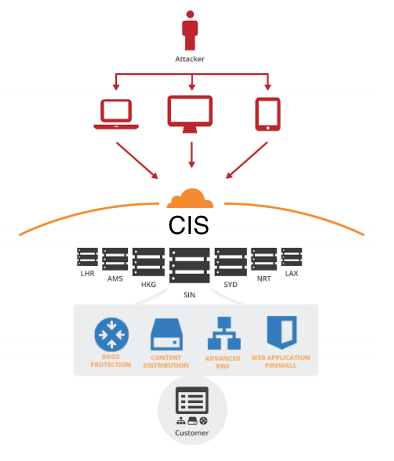

---
copyright:
  years: 2018
lastupdated: "2018-03-16"
---

{:shortdesc: .shortdesc}
{:new_window: target="_blank"}

# IBM CIS(Cloud Internet Services)가 작업의 보안을 유지하는 방법

IBM CIS는 대역폭과 서버 리소스를 낭비할 수 있는 오용 봇과 크롤러를 제한하고 위협을 차단하는 글로벌하게 분배된 클라우드 서비스입니다. IBM CIS는 글로벌 HTTP(S) 리버스 프록시 및 관리 대상 DNS 서비스 제공자로서 작동합니다. 웹 트래픽은 성능 및 보안을 모두 최적화하기 위해 지능형 글로벌 네트워크를 통해 라우트됩니다. 

다음은 빠른 기능 개요이다.

## 보안 기능

 * WAF(Web Application Firewall)
 * 무제한 DDoS 경감

## 보안 표준 및 플랫폼

 * TLS (SHA2 및 SHA1)
 * IPv6
 * HTTP/2 및 SPDY

## DNS

 * 글로벌 임의 캐스트 네트워크
 * DNSSEC

## 네트워크 공격 및 경감

일반적으로 당사는 두 가지 카테고리에 속하는 공격을 지켜봅니다. 

| 계층 3 또는 계층 4 공격 | 계층 7 공격 |
|------------------------------|-----------------|
|이러한 공격은 ISO 계층 3(네트워크 계층)의 트래픽 플러드(예: ICMP 플러드) 또는 계층 4(전송 계층)의 트래픽 플러드(예: TCP SYN 플러드 또는 반영된 UDP 플러드)로 구성되어 있습니다. |이는 악성 ISO 계층 7 요청(애플리케이션 계층)(예: GET 플러드)을 전송하는 공격입니다. |
| 에지에서 자동 차단됨 | “방어 모드”, WAF 및 보안 레벨 설정으로 이를 처리함 |

## 요약

 * 방어 모드는 많은 악성 클라이언트에 결핍된 브라우저 기능을 테스트함 
 * WAF는 악성일 가능성이 있는 알려진 요청 패턴을 차단하고 인증 확인함 
