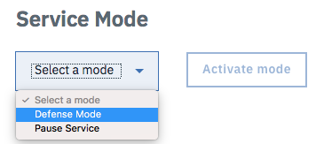

---
copyright:
  years: 2018
lastupdated: "2018-28-03"
---

{:shortdesc: .shortdesc}
{:new_window: target="_blank"}

# 常见问题及解答

## 我该如何处理 Early Access 方案？
根据设计，Early Access 计划仅允许每个帐户一个区域。建议仅为每个帐户创建一个实例，并验证区域名称。在添加区域名称之前对其进行验证至关重要。如果删除了区域，那么在 Early Access 计划期间无法添加另一个区域或同一区域。

## 为什么我的域处于“暂挂”状态？如何将其激活？
将域添加到 CIS 时，我们将向您提供一些名称服务器，以便在您的注册器中（或者如果正在添加子域则在 DNS 提供者处）进行配置。域或子域将保持暂挂状态，直到您正确配置名称服务器。请确保将名称服务器都添加到注册器或 DNS 提供者。我们定期扫描公用 DNS 系统以检查是否已按照指示配置了名称服务器。只要我们能够验证名称服务器的更改（最多可能需要 24 小时），就可以激活域。可以通过单击概述页面中的**重新检查名称服务器**，提交请求以重新检查名称服务器。

## 我的域的注册器是哪一个？
请参阅 https://whois.icann.org⁄以获取此信息。**注**：您必须具有管理特权才能在注册器中编辑您的域配置，以便在将域添加到 CIS 时更新或添加为您的域提供的名称服务器。如果您不知道正尝试将其添加到 CIS 的域的注册器，那么可能无权在注册器处更新域的配置。与组织中的域所有者一起进行必要的更改。

## 我希望保留我的域 (example.com) 的当前 DNS 提供者。是否可以从我的当前 DNS 提供者向 CIS 委派子域 (subdomain.example.com)？
可以。该过程类似于添加域，不过针对更高级别域将使用 DNS 提供者，而不是注册器。向 CIS 添加子域时，通常会为您提供两个名称服务器以进行配置。为这两台名称服务器都配置名称服务器 (NS) 记录，因为域中的 DNS 记录由其他 DNS 提供者管理。当我们能够验证是否已添加必需的 NS 记录时，会激活您的子域。如果您未在组织内管理更高级别的域，那么必须与更高级别域的所有者一起工作以添加 NS 记录。

## 什么是 TLS？
TLS 是一种标准安全协议，用于在联机通信中在 Web 服务器和浏览器之间建立加密链路。要创建与 Web 站点的 TLS 连接，需要 TLS 证书，此证书包含域名、公司名称以及公司地址、城市、省/自治区/直辖市以及国家或地区之类的其他数据。证书还显示截止日期以及发布证书的“认证中心 (CA)”的详细信息。

## TLS 如何工作？
当浏览器启动与 TLS 受保护 Web 站点的连接时，将首先检索该站点的 TLS 证书，以检查证书是否仍然有效。TLS 验证 CA 是否为浏览器信任的 CA，以及该证书是否由针对其发布证书的 Web 站点使用。如果其中任何一项检查失败，将收到一个警告，指示该 Web 站点未受到有效证书的保护。

在 Web 服务器上安装 TLS 证书后，会在 Web 服务器及所连接的浏览器之间实现安全连接。Web 站点的 URL 前缀为“https”而不是“http”，会在地址栏上显示挂锁。如果 Web 站点使用扩展验证 (EV) 证书，那么浏览器还可能会显示绿色地址栏。

## 我为什么会看到隐私警告？
IBM Cloud CIS 发布的 TLS 证书包含根域 (`example.com`) 和一级子域 (`*.example.com`)。如果尝试访问二级子域 (`*.*.example.com`)，那么将在浏览器中看到隐私警告，因为这些主机名未添加到 SAN 中。

另外，对于其中一个合作伙伴认证中心 (CA) ，请允许最长 15 分钟发布新证书。如果新证书尚未发布，那么将在浏览器中看到隐私警告。

## 什么是 DDoS？
分布式拒绝服务 (DDoS) 攻击是一种通过使用来自多个源的流量使联机服务溢出而导致其不可用的尝试。在 DDoS 攻击中，多个受损的计算机系统会攻击目标（例如，服务器、Web 站点或其他网络资源），这会影响目标资源的用户。

大量消息、连接请求或格式不正确的包传入目标系统会导致系统运行缓慢，甚至会崩溃或停机，因此拒绝为不合法的用户或系统提供服务。DDoS 攻击由不同的威胁参与者执行，从个人犯罪黑客到由组织犯罪团伙和政府机构。

## 如果我遭遇了 DDoS 攻击该怎么办？

**步骤 1：**在**概述**屏幕中打开“防卫模式”。 



**步骤 2：**设置 DNS 记录以实现最大程度的安全性。

**步骤 3：**不要对来自 IBM CIS 的请求进行速率限制或调速请求，我们需要带宽来帮助您解决该情况。

**步骤 4：**必要时阻止特定国家或地区和访客。

## 遇到 522 错误时该怎么办？

522 错误指示无法建立与源服务器（即，主机）的连接。连接失败大约 15 秒后，将关闭连接并显示 522 错误页面。

此问题通常是由防火墙或安全软件意外阻止了 IP 地址导致的。因为 CIS 充当逆向代理，所以与站点的连接将显示为来自一系列 CIS IP。此行为可能导致某些防火墙阻塞这些连接，这将导致无法向站点访问者提供正确内容。

要解决此问题，请让主机将[此处](whitelisted-ips.html)列出的所有 CIS IP 范围列入白名单。

必须将所有这些 IP 都列入白名单，才可避免 522 错误。还可以检查是否阻塞了这些范围中的任何 IP。

网络连接问题也可能导致 522 错误，因此请确认服务器和网络正常运行，且未超负荷。

如果在执行上述步骤后仍收到错误，请联系 IBM CIS 支持人员并确认以下内容：

* 您已将 IP 范围列入白名单
* 您的服务器/网络处于联机状态并且通常运行正常

如果您联系我们的支持团队，请提供最新 522 错误中的 ray ID。我们可以使用此 ID 来确定所攻击的 CIS 数据中心并执行进一步的测试。

## 什么是代理记录，为何需要这些记录？

已处理的记录是通过 IBM CIS 来代理其流量的记录。只有代理的记录享受了 CIS 优势（例如，IP 屏蔽），其中 CIS IP 将替换源 IP 以对其进行保护：

```
$ whois 104.28.22.57 | grep OrgName
OrgName:        IBM
```

如果希望改为绕过域中的 CIS（仍然会解析 DNS），那么不对记录使用代理可能能够实现此目的。

## 我收到 DNS 验证错误：1004；现在我可以执行什么操作？

要使页面规则有效，需要针对您的区域解析 DNS。因此，针对您的区域必须具有代理的 DNS 记录。 
