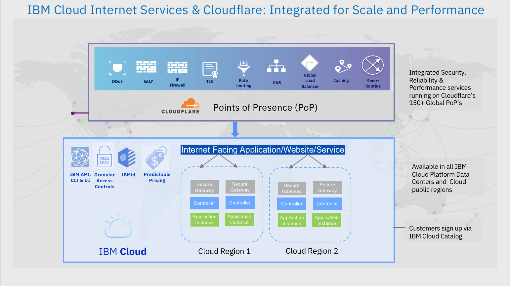

---

copyright:
  years: 2018, 2019
lastupdated: "2019-10-31"

keywords: CIDR blocks, Whitelist Block Challenge, IBM Cloud Internet Services, security features

subcollection: cis

---

{:shortdesc: .shortdesc}
{:new_window: target="_blank"}
{:codeblock: .codeblock}
{:pre: .pre}
{:screen: .screen}
{:term: .term}
{:tip: .tip}
{:note: .note}
{:important: .important}
{:deprecated: .deprecated}
{:external: target="_blank" .external}
{:generic: data-hd-programlang="generic"}
{:download: .download}
{:DomainName: data-hd-keyref="DomainName"}

# How {{site.data.keyword.cis_full_notm}} keeps your work secure
{:#how-cis-keeps-your-work-secure}

{{site.data.keyword.cis_full}} is a globally distributed cloud service that blocks threats and limits abusive bots and crawlers, which can waste your bandwidth and server resources. IBM {{site.data.keyword.cis_short_notm}} works as a global HTTP(S) reverse proxy and a managed DNS service provider. Your web traffic is routed through our intelligent global network to optimize both your performance and your security.
{: shortdesc} 

Here’s a quick feature overview:

## Security features
{:#cis-security-features}

 * Proxy [DNS records](/docs/infrastructure/cis?topic=cis-dns-concepts#dns-concepts-proxying-dns-records) or [GLB](/docs/infrastructure/cis?topic=cis-global-load-balancer-glb-concepts) to use security features. This allows traffic to flow through our servers and you can monitor the data.

### Web Application Firewall (WAF)
{:#cis-web-application-firewall}

 * WAF is implemented through two rule sets: [OWASP](/docs/infrastructure/cis?topic=cis-owasp-rule-set-for-waf) and [{{site.data.keyword.cis_short_notm}}](/docs/infrastructure/cis?topic=cis-waf-settings#cis-ruleset-for-waf).

### Unlimited DDoS mitigation
{:#cis-unlimited-ddos-mitigation}

 * DDoS mitigation is typically an expensive service that can grow in cost when under attack. Unlimited DDoS mitigation is included with {{site.data.keyword.cis_short_notm}} at no additional cost.

## Security standards and platform
{:#security-standards-and-platform}

 * TLS (SHA2 and SHA1)
 * IPv6
 * HTTP/2 and SPDY

## DNS
{:#cis-dns}

 * Global anycast network
 * DNSSEC

## Network attacks and mitigation
{:#network-attacks-and-mitigation}

Generally, attacks that fall into two categories:

| Layer 3 or Layer four attacks | Layer 7 attacks |
|------------------------------|-----------------|

|These attacks consist of a flood of traffic at ISO Layer 3 (the network layer), such as ICMP floods), or at Layer 4 (the transport layer), such as TCP SYN floods or reflected UDP floods) |These are attacks that send malicious ISO Layer 7 requests (the application layer), such as GET floods.  |
| Automatically blocked at our edge | We handle these with "Defense Mode," WAF, and Security level settings |

## IP Firewall
{:#cis-ip-firewall}

{{site.data.keyword.cis_full_notm}} offers several tools for controlling your traffic so that you protect your domains, URLs, and directories against volumes of traffic, certain groups of requesters, and particular requesting IPs. This section details the tools available.

### IP Rules
{:#cis-ip-rules}

The IP Rules allow you to control access for specific IP addresses, IP ranges, specific countries, specific ASNs, and certain CIDR blocks. Available actions on incoming requests are:
  * Whitelist
  * Block
  * Challenge (Captcha)
  * JavaScript Challenge (IUAM challenge)

For example, if you notice that a particular IP is causing malicious requests, you can block that user by IP address.

### User-Agent Blocking Rules
{:#user-agent-blocking-rules}

User-Agent Blocking rules allow you to act on any User-Agent string you select. This capability works like Domain Lockdown as described previously, except the block examines the incoming User-Agent string rather than the IP. You can choose how to handle a matching request with the same list of actions as you established in the IP Rules (Block, Challenge, and JS Challenge). User-Agent blocking applies to your entire zone. You cannot specify subdomains in the same manner you can Domain Lockdowns.

This tool is useful for blocking any User-Agent strings that you deem suspicious.

### Domain Lockdown
{:#cis-domain-lockdown}

Domain Lockdown allows you whitelist-specific IP addresses and IP ranges such that all other IPs are blacklisted. Domain Lockdown supports:

  * Specific subdomains. For example, you can allow IP `1.2.3.4` access to the domain `foo.example.com` and allow IP `5.6.7.8` access to domain `bar.example.com`, without necessarily allowing the reverse.
  * Specific URLs. For example, you can allow IP `1.2.3.4` access to directory `example.com/foo/*` and allow IP `5.6.7.8`  access to directory `example.com/bar/*`, but not necessarily allow the reverse.
This capability is useful when you need more granularity in your access rules because, with the IP Rules, you can either apply the block to all subdomains of the current domain, or all domains on your account, and you cannot specify URIs.

### Challenge Passage
{:#cis-challenge-passage}

Located in the **Advanced** security settings, use this setting to control how long a visitor that passed a challenge (or JavaScript challenge) will gain access to your site before being challenged again. This is based on the visitor's IP and therefore, does not apply to challenges presented by WAF rules because they are based on an action the user performs on your site.

### Browser Integrity Check
{:#cis-browser-integrity-check}

This setting is located in the **Advanced** security settings. The browser integrity check looks for HTTP headers that are commonly abused by spammers. It denies traffic with those headers access to your page. It also blocks or challenges visitors that do not have a user agent, or who add a non-standard user agent (this tactic is commonly used by abuse bots, crawlers, or APIs).
